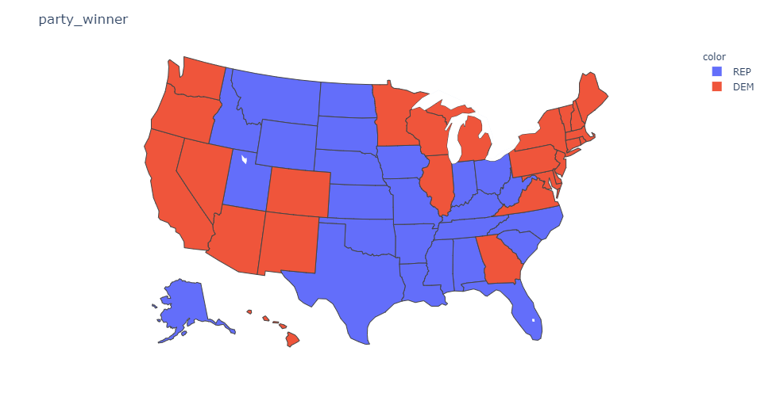

```{r global_options, include=FALSE}
knitr::opts_chunk$set(fig.pos = 'H')
```
COMENTARIO: Para obtener todo el código(https://felixfan.github.io/extract-r-code/)

\newpage


# 1. Descripción del Dataset
Los datasets con los que vamos a realizar la práctica estan relacionados con el número de votos por estado de EEUU en las recientes elecciones. Se han obtenido de [Kaggle](https://www.kaggle.com/): 

- [Participación por Estado](https://www.kaggle.com/imoore/2020-us-general-election-turnout-rates)
- [Partido ganador por Estado](https://www.kaggle.com/paultimothymooney/percent-voting-for-democratic-party-by-state)

Cabe destacar que los datos presentes en el primer dataset tratan únicamente la población con derecho a voto, es decir, únicamente los estadounidenses mayores de 18 años. La primera fila del dataset incluye información de la totalidad del país.

En cuanto a los datos del segundo dataset, el número total de votos totales de republicanos y democratas no coincide con el total de votos por estado del primer juego de datos Esto es debido a que no se han contabilizado el número de votos a terceros partidos. Por ese motivo dicho dataset se va a utilizar para sacar el partido ganador en cada estado y se va añadir al primer juego de datos. Asimismo, este dataset ya ha sido tratado y no es necesario realizar tareas de limpieza, por lo que únicamente se va a utilizar para complementar el primer juego de datos.

El dataset con los datos referentes a las votaciones dispone de 15 columnas:

* **State**: Indica el estado del que trata la fila de datos.
* **Source**: Fuente de datos (url).
* **Official/Unofficial**: Esta columna indica si los datos reportados son una vez el conteo ha alcanzado el 100% (oficial), o si aún no se ha terminado el conteo (unofficial).
* **Total Ballots Counted (Estimate)**: número total de votos en dicho estado.
* **Vote for Highest Office**: Votos válidos.
* **VEP Turnout Rate**: Porcentaje de votantes. VEP, en inglés: Voting Elegible Population
* **Voting-Eligible Population**: Población con derecho a voto.
* **Voting-Age Population (VAP)**: Población total de estados unidos con 18 años o más, incluyendo a personas sin derecho a voto por razones diferentes a la edad, como personas sin la nacionalidad o criminales de ciertos estados, donde la ley se lo prohibe. [fuente](https://usafacts.org/data/topics/people-society/democracy-and-society/elections/presidential-voting-age-population/)
* **% Non-citizen**: Porcentaje de personas con derecho a voto que no son ciudadanos estadounidenses.
* **Prision**: Número de votantes desde la carcel.
* **Probation**: Número de criminales con el tercer grado. Es decir, disfrutan de un periodo fuera de la carcel bajo supervisión.
* **Parole**: Personas con permiso de permanencia temporal en EEUU.
* **Total Ineligible Felon**: Número de personas en dicho estado que no tienen derecho a voto por criminalidad.
* **Overseas Eligible**: Número de estadounidenses viviendo fuera del país, independientemente del estado.
* **State abv**: Abreviatura del estado.

El dataset con los datos referentes a las votaciones a republicanos y democratas contiene la siguiente información:

* **State**: Indica el estado del que trata la fila de datos.
* **DEM**: Número de votos de los demócratas.
* **REP**: Número de votos de los republicanos.
* **usa_state**:  Indica el estado del que trata la fila de dato.
* **usa_state_code**: Abreviatura del estado.
* **percent_democrat**: Porcentaje de votos a los demócratas


Antes de proseguir, cargaremos los datos relativos al primer dataset y realizaremos una breve inspección sobre los mismos (excepto sobre la columna sources, que contiene urls), para estudiar los valores contenidos en cada columna.

```{r}
fileDirectory <- getwd()
csv_usa <- file.path(fileDirectory, '2020 November General Election - Turnout Rates.csv')
usa_elections <- read.csv(csv_usa)
attach(usa_elections)
```

```{r warning = FALSE, message=FALSE}
head(usa_elections[,-2])
```

Cargamos el segundo dataset
```{r}
csv_dem_rep<- file.path(fileDirectory, 'democratic_vs_republican_votes_by_usa_state_2020.csv')
usa_winner <- read.csv(csv_dem_rep)
attach(usa_winner)
```

```{r warning = FALSE, message=FALSE}
head(usa_winner)
```


## 1.1. Importancia y objetivo del análisis
Gracias a este dataset podemos estudiar como ha influido el numero de votantes y el porcentaje total de votaciones para que en unos estados u otros hayan ganado los demócratas. También podremos plantear algunas clonclusiones sobre las diferencias por estados en cuanto a votos republicanos o demócratas.

Estos análisis son de gran relevancia a la hora de establecer patrones de voto en grupos poblacionales en función de ciertas características, en este caso, según el estado de residencia. Además, disponiendo de conjuntos como este para cada año de elecciones durante un largo periodo de tiempo, podríamos predecir con Machine Learning cuál va a ser el comportamiento de los votantes de cada estado en base a su historia electoral.

# 2. Integración y selección de los datos de interés a analizar

En vistas a la descripción de las columnas observamos que disponemos de columnas repetidas, como es el caso de la abreviatura del estado y el nombre del mismo. Por ello, la columna relativa al nombre completo del estado será el primero que eliminemos, con el fin de evitar redundancia en los datos. 

```{r}
usa_abreviaturas = usa_elections[, ncol(usa_elections)]
usa_elections <- usa_elections[, -ncol(usa_elections)]
usa_elections[,1] <- usa_abreviaturas
```

Proseguiremos con la nueva última columna, "Overseas Eligible", que se refiere al número de estadounidenses viviendo fuera del país. Ésta columna solo tiene un valor diferente a null, y está relacionado con el dato en la primera fila, correspondiente con la totalidad de estados. Es por ello, que a continuación retiraremos la priemra fila y la guardaremos en una variable, para así poder estuadiar los datos por estado, pero manteniendo la información del total por si nos hiciese falta a continuación. Finalmente eliminaremos la columna "Overseas Eligible", dado que todos sus valores son null.

```{r}
usa_total <- usa_elections[1,]
usa_elections <- usa_elections[2:nrow(usa_elections),-ncol(usa_elections)]
```

La carencia de utilidad de las columnas relativas a la fuente de datos y si se trata de una fuente oficial o no, hacen que también procedamos a eliminarlas del dataset.

```{r}
usa_elections <- usa_elections[,-c(grep("Source", colnames(usa_elections)), grep("Official.Unofficial", colnames(usa_elections)))]
```

Por último se va a generar la columna `party_winners` a partir de los datos del segundo juego de datos. Para ello se van a comparar las columnas REP y DEM y se va a sacar el ganador de cada estado.

```{r}
party_winner<- ifelse(DEM>REP, "DEM","REP")
usa_elections$party_winner<-party_winner
```

Una vez añadida la nueva columna al dataset original se va a proceder a realizar el análisis.

# 3. Limpieza de los datos

En este apartado llevaremos a cabo un proceso de limpieza de datos, comenzando por establecer los tipos de datos correctos para cada variable (columna), y gestionando los valores nulos (casillas vacías). Finalmente, estudiaremos la presencia de valores extremos y cómo tratarlos.

## 3.1. Tipos de Variables {#tiposDeVariables}
Cada columna de nuestro dataframe ``` usa_elections ``` es un Factor, conteniendo diferentes niveles. En el siguiente resumen de nuestro dataframe podemos observar el tipo de datos correspondiente con cada uno de ellos.

```{r}
str(usa_elections)
```
Como se aprecia, los datos numéricos se han cargado como strings, por lo que podemos concluir que las única columnas que se encuentran en un tipo correcto son la primer y la última, State y party_winner. Esta última se deberá convertir a un tipo factor, puesto que representa la clase democrata o republicano. Para el resto de columnas debemos aplicar una limpieza, quitando los caracteres no numéricos y así poder convertirlos al tipo de datos correcto. Además, dichas columnas no queremos que sean de tipo Factor, dado que son variables contínuas, la única que mantendremos como tipo Factor será State, dado que es una variable discreta.

Para ello definiremos dos funciones, que aplicaremos a las columnas que lo necesiten. Estas funciones eliminarán los caracteres necesarios para a continuación poder convertir los datos a números.

```{r}
# Definición de las funciones
remove_comma <- function(x) gsub(',', '', x)
remove_percent <- function(x) gsub('%', '', x)

# Aplicación de las mismas sobre las columnas apropiadas
usa_elections[,2] <- sapply(usa_elections[,2], remove_comma)
usa_elections[,3] <- sapply(usa_elections[,3], remove_comma)
usa_elections[,4] <- sapply(usa_elections[,4], remove_percent)
usa_elections[,5] <- sapply(usa_elections[,5], remove_comma)
usa_elections[,6] <- sapply(usa_elections[,6], remove_comma)
usa_elections[,7] <- sapply(usa_elections[,7], remove_percent)
usa_elections[,8] <- sapply(usa_elections[,8], remove_comma)
usa_elections[,9] <- sapply(usa_elections[,9], remove_comma)
usa_elections[,10] <- sapply(usa_elections[,10], remove_comma)
usa_elections[,11] <- sapply(usa_elections[,11], remove_comma)
```

Una vez obtenido el resultado necesario para poder convertir al tipo deseado, ejecutamos las siguientes líneas:
```{r}
usa_elections[,2] <- as.numeric(usa_elections[,2])
usa_elections[,3] <- as.numeric(usa_elections[,3])
usa_elections[,4] <- as.numeric(usa_elections[,4])
usa_elections[,5] <- as.numeric(usa_elections[,5])
usa_elections[,6] <- as.numeric(usa_elections[,6])
usa_elections[,7] <- as.numeric(usa_elections[,7])
usa_elections[,8] <- as.numeric(usa_elections[,8])
usa_elections[,9] <- as.numeric(usa_elections[,9])
usa_elections[,10] <- as.numeric(usa_elections[,10])
usa_elections[,11] <- as.numeric(usa_elections[,11])
```

Acto seguido convertimo a tipo factor la variable cualitativa party_winner.

```{r}
usa_elections[,12] <- as.factor(usa_elections[,12])
```
Finalmente, imprimiremos el resumen de las columnas de nuestro dataset para comprobar que todo se ha transformado correctamente.

```{r}
str(usa_elections)
```

## 3.2. Gestión de datos inválidos
Para comprobar qué columnas contienen datos 'vacíos' y poder proceder a trabajar con ellas, utilizaremos la función colSums, que aplica una función a todas las columnas de un dataframe y después aplica una suma.

```{r}
colSums(is.na(usa_elections))
```

Como vemos, únicamente disponemos de una columna con datos vacíos, Vote for Highest Office President. Este campo indica el número de votos válidos para la presidencia. Al no disponer de dicha información se ha decidido calcular la media de votos totales que si disponen de la información de votos a la presidencia y la media de la columna votos a la presidencia. Una vez obtenidas ambas medias se va a calcular el porcentaje medio de votos que han sido válidos para la presidencia y se van a extrapolar al conjunto de datos vacíos. Es decir, se va a multiplicar el porcentaje de votos válidos al total de votos en aquellos estados en que dicho campo este vacío.

```{r}
# Calculamos la media de los votos válidos para la presidencia
mean_president=mean(usa_elections$Vote.for.Highest.Office..President.,na.rm=TRUE)
# Calculamos la media de votos totales que tienen información sobre los votos a la presidencia
mean_total=mean(usa_elections$Total.Ballots.Counted..Estimate.[!is.na(usa_elections$Vote.for.Highest.Office..President.)],na.rm=TRUE)
# Sacamos el procentaje de la media de votos válidos
percentage_votes= mean_president/mean_total
# Aplicamos dicho porcentage a los votos totales que no disponen dicha información y guardamos los votos válidos en su correspondiente estado
# Como los votos deben de ser un numero entero se va a redondear el resultado de multiplicar los votos totales por el porcentage de votos válidos
usa_elections$Vote.for.Highest.Office..President.<-ifelse(is.na(usa_elections$Vote.for.Highest.Office..President.),trunc(usa_elections$Total.Ballots.Counted..Estimate. * percentage_votes), usa_elections$Vote.for.Highest.Office..President.  )

```

Comprobamos que ya no existan valores NA con el siguiente código:

```{r}
colSums(is.na(usa_elections))
```

Pese a que ya no encontramos valores NA, destacamos algunas columnas cuantitativas en las que aparecen valores igual a 0.
```{r}
sapply(usa_elections, function(r) any(c(0) %in% r))
```

Se ha investigado si en dichos estados existe una prisión, y la información encontrada ha sido que sí existe en la mayoría de ellos. Es una excepción el caso de 'District of Columbia', en el que tenemos valor 0 para todos los datos relacionados con presidiarios, ya que no dispone de una carcel, y los ciudadanos de dicho distrito se delegan a otras cárceles. Sin embargo, consideramos que pese a que sus ciudadanos cumplan condena en otro estado, debería verse reflejado el dato. Es por ello que aplicaremos la misma gestión de datos inválidos que anteriormente con las columnas Prision, Probation, Parole y Total.Inelegible.Felon. Es decir, según la media de votantes totales en otros estados donde sí que tenemos datos con respecto a cada una de estas variables carcelarias, obtendremos un porcentaje y rellenaremos así los datos con actual valor 0.

```{r}
# Dado que vamos a ejecutar estas líneas de código en diferentes ocasiones, crearemos una función.
replace_0 <- function(column_index) {
  mean_column <- mean(usa_elections[,column_index])
  mean_total = mean(usa_elections$Total.Ballots.Counted..Estimate.[!is.na(usa_elections[,column_index])])
  percentage_votes = mean_column/mean_total
  final_column <- ifelse(usa_elections[,column_index] == 0,trunc(usa_elections$Total.Ballots.Counted..Estimate. * percentage_votes), usa_elections[,column_index])
  return(final_column)
}

usa_elections$Prison <- replace_0(which(colnames(usa_elections) == "Prison"))
usa_elections$Probation <- replace_0(which(colnames(usa_elections) == "Probation"))
usa_elections$Parole <- replace_0(which(colnames(usa_elections) == "Parole"))
usa_elections$Total.Ineligible.Felon <- replace_0(which(colnames(usa_elections) == "Total.Ineligible.Felon"))

```

## 3.3. Identificación y tratamiento de valores extremos

Los valores extremos o outliers son aquellos que parecen no ser congruentes si los comparamos con el resto de los datos. Para identificarlos, podemos hacer uso de dos vías: (1) representar un diagrama de caja por cada variable y ver qué valores distan mucho del rango intercuartílico (la caja) o (2) utilizar la función boxplots.stats() de R, la cual se emplea a continuación. Así, se mostrarán sólo los valores atípicos para aquellas variables que los contienen:


```{r}
boxplot.stats(usa_elections$Total.Ballots.Counted..Estimate.)$out
```


```{r}
boxplot.stats(usa_elections$Vote.for.Highest.Office..President.)$out
```

```{r}
boxplot.stats(usa_elections$VEP.Turnout.Rate)$out
```

```{r}
boxplot.stats(usa_elections$Voting.Eligible.Population..VEP.)$out
```

```{r}
boxplot.stats(usa_elections$Voting.Age.Population..VAP.)$out
```

```{r}
boxplot.stats(usa_elections$X..Non.citizen)$out
```

```{r}
boxplot.stats(usa_elections$Prison)$out
```

```{r}
boxplot.stats(usa_elections$Probation)$out
```

```{r}
boxplot.stats(usa_elections$Parole)$out
```

```{r}
boxplot.stats(usa_elections$Total.Ineligible.Felon)$out
```

Como se puede observar, existen entre 3 y 4 valores extremos superiores para prácticamente cada variable. Esto es debido a que dichos datos pertenecen a los 4 estados con más población de estados unidos que son California, Texas, Florida y Nueva York. Por lo tanto se tratan de valores extremos legítimos que no deben ser tratados ya que a más población se espera que hayan más número de votos, población con derecho a voto, etc. Asimismo algunos de estos datos, como el número total de votos en California, se han comprobado en las fuentes facilitadas en el juego de datos original y se han confirmado que son valores probables.

## 3.4. Normalización de los datos

Ahora que disponemos de todos los datos, están en el formato adecuado, y hemos completado los valores inválidos, procedemos a normalizar las columnas cuantitativas. Trabajaremos con los datos en un rango entre 0 y 1, dado que nuestro objetivo es proponer un modelo de regresión, esto mejorará los resultados.

```{r}
my_scale <- function(column_index) {
  min_col <- min(as.numeric(usa_elections[,column_index]))
  max_col <- max(as.numeric(usa_elections[,column_index]))
  column_scaled <- (usa_elections[,column_index] - min_col) / (max_col - min_col)
  return(column_scaled)
}

indexes_to_scale = c(2:(ncol(usa_elections) - 1))
for (col in indexes_to_scale){
  usa_elections[,col] <- my_scale(col)
}
```

De esta forma, podemos comprobar que todas las columnas se han escalado en el rango deseado.

```{r}
head(usa_elections)
```

Cabe destacar que escalar los datos a dicho rango no cambiará la distribución de las variables.

## 3.4. Exportación de los datos preprocesados

Una vez que hemos acometido sobre el conjunto de datos inicial los procedimientos de integración, validación y limpieza anteriores, procedemos a guardar estos en un nuevo fichero denominado 2020 November General Election - Turnout Rates_data_clean.csv:

```{r}
write.csv(usa_elections, "2020 November General Election - Turnout Rates_data_clean.csv",  row.names = FALSE)
```

# 4. Análisis de los datos

Gracias al tratamiento de los datos como numéricos en el [punto 3.1](#tiposDeVariables), podemos ejecutar pequeños análisis estadísticos, en los que observar la distribución de los datos.

```{r}
summary(usa_elections)
```

## 4.1. Selección de los grupos de datos a analizar

COMENTAR!

El primer análisis que se va a realizar es comprobar la correlación entre las variables cuantitativas que han tenido mayor incidencia en el porcentaje de participación que ha habido por estado.

En segundo lugar, una vez se haya comprendido la incidencia entre estas variables, se va analizar si la media del porcentaje de participación ha sido mayor en los estados en que han ganado los demócratas o los republicanos. Para ello se van a agrupar los datos según el partido ganador

```{r}
# Agrupación por ganadores
usa_elections.dem=usa_elections[usa_elections$party_winner=="DEM",]
usa_elections.rep=usa_elections[usa_elections$party_winner=="REP",]
```

Finalmente se va a realizar una regresión lineal para predecir, según los datos que presenten una mayor dependencia, que partido ganaría en cada estado, cuál va a ser  el porcentaje de votacion en cada estado y una regresión logística para predecir el partido ganador según el estado.

## 4.2. Comprobación de la normalidad y homogeneidad de la varianza
Para la comprobación de que los valores que toman nuestras variables cuantitativas provienen de una población distribuida normalmente, utilizaremos las pruebas de normalidad de Anderson-Darling y Shapiro-Wilk. Así, se comprueba que para que cada prueba se obtiene un p-valor superior al nivel de significación prefijado $\alpha =0,05$. Si esto se cumple, entonces se considera que la variable en cuestión sigue una distribución normal.

```{r}
library(nortest)
alpha = 0.05
col.names = colnames(usa_elections)
for (i in 1:ncol(usa_elections)) {
  if (i == 1) cat("Variables que no siguen una distribución normal segun el test de Anderson-Darling:\n")
  if (is.integer(usa_elections[,i]) | is.numeric(usa_elections[,i])) {
    p_val = ad.test(usa_elections[,i])$p.value
    if (p_val < alpha) {
      cat(col.names[i])
      # Format output
      if (i < ncol(usa_elections) - 1) cat(", ")
      if (i %% 3 == 0) cat("\n")
    }
  }
}
```

```{r}
library(nortest)
alpha = 0.05
col.names = colnames(usa_elections)
for (i in 1:ncol(usa_elections)) {
  if (i == 1) cat("Variables que no siguen una distribución normal segun el test de Shapiro-Wilk:\n")
  if (is.integer(usa_elections[,i]) | is.numeric(usa_elections[,i])) {
    p_val = shapiro.test(usa_elections[,i])$p.value
    if (p_val < alpha) {
      cat(col.names[i])
      # Format output
      if (i < ncol(usa_elections) - 1) cat(", ")
      if (i %% 3 == 0) cat("\n")
    }
  }
}
```

Como se puede observar, en ambos casos se han obtenido los mismos resultados, por lo que podemos concluir que las variables devueltas en ambos casos no siguen una distribución normal con un 95% de confianza. En cualquier caso, para el contraste de hipótesis que se va a realizar en la aplicación de pruebas estadísticas nos interesa saber si la variable VEP.Turnout.Rate sigue una distribución normal según al grupo que pertenezca del partido ganador. Para averiguarlo se van a utilizar los grupos anteriormente creados.

En primer lugar vamos a mostrar el histograma para el partido demócrata y el republicano con su densidad de probabilidad:

```{r}
# Cremaos las variables turnout en función del partido ganador
turnout_dem <- usa_elections.dem$VEP.Turnout.Rate
turnout_rep <- usa_elections.rep$VEP.Turnout.Rate
```

```{r Fig1, echo=TRUE, fig.height=8, fig.width=15} 
par(mfrow=c(1,2), mar=c(4,4,4,1), oma=c(0.5,0.5,0.5,0)) 

# histograma, densidad de probabilidad y normal calculada para turnout
hist(turnout_dem, col = 'lightcyan',
     main = 'Democratas',
     freq = FALSE,
     xlab = 'Turnout Democratas ',
     pch=16)
lines(density(turnout_dem), 
      col = 'blue', 
      lwd='4')
curve(dnorm(x,mean(turnout_dem), sd(turnout_dem)),col='green', lwd=4, add=T)


hist(turnout_rep, col = 'lightcyan',
     main = 'Republicanos',
     freq = FALSE,
     xlab = 'Turnout Republicanos',
     pch=16)
lines(density(turnout_rep), 
      col = 'blue', 
      lwd='4')
curve(dnorm(x,mean(turnout_rep), sd(turnout_rep)),col='green', lwd=4, add=T)

```

Observando ambas gráficas se puede observar que en ambos casos se sigue una distribución fiel a la curva de la normal, aunque era de esperar porque cuando se ha analizado en conjunto en los test anteriores la variable VEP.Turnout.Rate seguía una distribución normal. Para terminar se va a realizar el test de Saphiro-Wilk para confirmar su normalidad:


```{r}
shapiro.test(turnout_dem)
```

```{r}
shapiro.test(turnout_rep)
```

Para ambos caso el p-value es superior al nivel de significación 0.05, por lo que se puede asumir la normalidad de ambos grupos.

En cuanto a la varianza, se desea analizar la varianza relativa a los ganadores en cada estado en función del porcentaje de participación de la población. Como se ha observado anteriormente la variable VEP.Turnout.Rate sigue una distribución normal, por lo que para analizar la varianza se van a utilizar dos test, el de Fligner-Killeen y la función `var.test()`de R.


```{r}
fligner.test(VEP.Turnout.Rate ~ party_winner, data = usa_elections)
```

```{r}
var.test(turnout_dem,turnout_rep)
```

En ambos caso el p-valor es superior al nivel de significación 0.05, por lo que se acepta la hipótesis nula de homocedasticidad y se conluye que la variable VEP.Turnout.Rate presenta varianzas estadísticamente iguales para los dos grupos de party_winner.

## 4.3. Aplicación de pruebas estadísticas

### 4.3.1.  ¿Qué variables cuantitativas han influido más en el porcentaje de participación en las elecciones? {#VariablesCuantitativas}

En primer lugar, procedemos a realizar un análisis de correlación entre las distintas variables para determinar cuáles de ellas ejercen una mayor influencia sobre el partido ganador en cada estado. Para ello, se utilizará el coeficiente de correlación de Spearman, puesto que hemos visto que tenemos datos que no siguen una distribución normal.

```{r}
corr_matrix <- matrix(nc = 2, nr = 0)
colnames(corr_matrix) <- c("estimate", "p-value")
# Calcular el coeficiente de correlación para cada variable cuantitativa
# con respecto al campo "party_winner"
for (i in 2:(ncol(usa_elections) - 1)) {
  if (i!=4){
    if (is.integer(usa_elections[,i]) | is.numeric(usa_elections[,i])) {
      spearman_test = cor.test(usa_elections[,i], usa_elections[,4], method = "spearman", exact=FALSE)
      corr_coef = spearman_test$estimate
      p_val = spearman_test$p.value
      # Add row to matrix
      pair = matrix(ncol = 2, nrow = 1)
      pair[1][1] = corr_coef
      pair[2][1] = p_val
      corr_matrix <- rbind(corr_matrix, pair)
      rownames(corr_matrix)[nrow(corr_matrix)] <- colnames(usa_elections)[i]
    }
  }
  else{
    next()
  }
}
```

```{r}
print(corr_matrix)
```

Como se puede observar, la correlación existente entre las distintas variables cuantitativas y el porcentaje de participación en las elecciones no es muy elevado. Asimsimo, los p-values obtenidos han sido mayores al nivel de significación, por lo que se acepta la hipotesis nula que confirma que no existe una gran correlación entre estas variables y la participación (turnout).

### 4.3.2.  ¿Es el valor del porcentaje de participación en las elecciones superior en aquellos estados en el que han ganado los democratas?

La segunda prueba estadística que se aplicará consistirá en un contraste de hipótesis sobre dos muestras para determinar si el valor del porcentaje de participación en las elecciones es superior dependiendo del partido que ha ganado. Para ello, tendremos dos muestras: la primera de ellas se corresponderá con los valores de la proporción de participación en aquellos estados donde han ganado los demócratas y, la segunda, con aquellos donde han ganado los republicanos. Tal y como se ha comprobado anteriormente, nuestras muestras siguen una distribución normal y presentan una desviación estándar igual, por lo que se puede aplicar un contraste de hipótesis utilizando un test paramétrico. En este caso las medias seguirán una distribución $t$ de Stuent con $n_1+n_2 -2$ grados de libertad. Por lo tanto, el contraste de hipótesis quedaría de la siguiente forma:

Hipótesis nula:

$$ H_o: \mu_1 = \mu_2 $$

Hipótesis alternativa:

$$ H_1: \mu_1 > \mu_2 $$

Siendo $\mu_1$ la media poblacional del porcentaje de partipación donde han ganado los demócratas y $\mu_2$ donde han ganado los republicanos.

Tal y como se ha comentado anteriormente se va a utilizar un test paramétrico utilizando la función `t.test()`de R, donde se le especificará que se tratan de varianzas iguales.

```{r}
t.test(turnout_dem,turnout_rep,alternative="greater", var.equal=TRUE)
```

Como se puede observar el p-value obtenido ha sido inferior al nivel de significación $\alpha=0.05$, por lo tanto se rechaza la hipotésis nula en favor de la alternativa y se puede afirmar con un 95% de confianza que el porcentaje de participación en las elecciones americanas ha sido superior en aquellos estados donde han ganado los democratas, es decir que en los estados donde ganó Joe Biden hubo mayor incidencia de participación con un 95% de confianza.

### 4.3.3.  Regresión Lineal 

Tal y como se planteó en los objetivos de la actividad, resultará de mucho interés poder realizar predicciones sobre cual podría ser el porcentaje de participación en las siguientes elecciones . Así, se calculará un modelo de regresión lineal utilizando regresores tanto cuantitativos como cualitativos con el que poder realizar las predicciones de los porcentajes. Para obtener un modelo de regresión lineal considerablemente eficiente, lo que haremos será obtener varios modelos de regresión utilizando las variables que estén más correlacionadas, con respecto al valor del turnout de votos, según la tabla obtenida en el apartado [4.3.1](#VariablesCuantitativas). Como variable cualitativa únicamente se pasará el partido ganador. Así, de entre todos los modelos que tengamos, escogeremos el mejor utilizando como criterio aquel que presente un mayor coeficiente de determinación (R2). Cabe destacar que las correlaciones obtenidas anteriormente no han sido muy elevadas, pero aun así se va intentar construir un modelo que permita predecir el valor del turnout.

```{r}
# TODO: revisar por qué con todas las variables da mejor resultado que solo con las que tienen más correlación
votos = usa_elections$Total.Ballots.Counted..Estimate.
votos_validos = usa_elections$Vote.for.Highest.Office..President.
vep= usa_elections$Voting.Eligible.Population..VEP.
vap = usa_elections$Voting.Age.Population..VAP.
no_ciudadanos = usa_elections$X..Non.citizen
prision = usa_elections$Prison
probation=usa_elections$Probation
parole=usa_elections$Parole
felon = usa_elections$Total.Ineligible.Felon

# Regresores cualitativos
winner=usa_elections$party_winner

# Variable a predecir
turnout = usa_elections$VEP.Turnout.Rate

# Modelo usando todas las variables
model <- lm(turnout ~ votos  + votos_validos + vep + vap + no_ciudadanos + prision + probation + parole + felon + winner, data = usa_elections)
summary(model)$r.squared
# Modelo usando únicamente las variables cuantitativas que tienen una correlación positiva
model_positive <- lm(turnout ~ votos  + votos_validos + vep + vap + no_ciudadanos + probation + winner, data = usa_elections)
summary(model_positive)$r.squared

# Generación de varios modelos
# modelo1 <- lm(turnout ~   votos_validos + parole + vep, data = usa_elections)
# 
# modelo2 <- lm(turnout ~ winner  + votos +  + parole +probation  , data = usa_elections)
# 
# modelo3 <- lm(turnout ~ winner  + votos + vep + parole +probation , data = usa_elections)
# 
# modelo4 <- lm(turnout ~  winner + votos + votos_validos + parole + probation , data = usa_elections)
# 
# modelo5 <- lm(turnout ~ winner  + votos + parole +probation , data = usa_elections)
```

Para los anteriores modelos de regresión lineal múltiple obtenidos, podemos utilizar el coeficiente de determinación para medir la bondad de los ajustes y quedarnos con aquel modelo que mejor coeficiente presente.

```{r}
# Tabla con los coeficientes de determinación de cada modelo
# tabla.coeficientes <- matrix(c(1, summary(modelo1)$r.squared,
# 2, summary(modelo2)$r.squared,
# 3, summary(modelo3)$r.squared,
# 4, summary(modelo4)$r.squared,
# 5, summary(modelo5)$r.squared),
# ncol = 2, byrow = TRUE)
# colnames(tabla.coeficientes) <- c("Modelo", "R^2")
# tabla.coeficientes
```

Como se puede observar, el modelo que mejor se ha ajustado ha sido el tercero puesto que su coeficiente de determinación ha sido el más elevado. Ahora, empleando este modelo, podemos proceder a realizar un prediccion de participación en las elecciones 
```{r}
# TODO: escalar
newdata <- data.frame(
winner= "REP",
votos = 800000,
vep = 1400000,
parole = 4000,
probation = 7000
)

# Predecir el turnout
#predict(modelo3, newdata)
```

Con los datos propuestos se obtendría un 63.38 % de aprticipación en las elecciones en un estado en concreto.

### 4.3.4.  Regresión logística 

La siguiente regresión se va a realizar con el objetivo de predecir la variable dicatómica party_winner. La estrategia a seguir en este caso va a ser generar distintos modelos con las mismas variables que para la regresión lineal añadiendo la variable turnout. En este caso, al no disponer del coeficiente de determinación, se van a evaluar las matrices de confusión de cada modelo y se va a calcular la precisión de cada modelo con el objetivo de seleccionar aquel que mejor realice la predicción de que partido ganaría.

```{r}
# Generación de varios modelos

modelo <- glm(as.factor(winner) ~ votos  + votos_validos + vep + vap + no_ciudadanos + prision + probation + parole + felon, family = binomial(link=logit))

modelo_possitive <- glm (as.factor(winner) ~ votos  + votos_validos + vep + vap + no_ciudadanos + probation + turnout, family = binomial(link=logit))

# modelo1 <- glm(as.factor(winner) ~   votos + parole + vep +turnout, data = usa_elections,family=binomial(link=logit))
# 
# modelo2 <- glm(as.factor(winner) ~  turnout  + parole +probation  , data = usa_elections, family=binomial(link=logit))
# 
# modelo3 <- glm(as.factor(winner) ~  votos_validos + turnout  +probation + parole , data = usa_elections, family=binomial(link=logit))

```

```{r}
get_precision <- function(table) {
  df <- as.data.frame(table)
  true_DEM <- df[1, "Freq"]
  true_REP <- df[4, "Freq"]
  return((true_DEM + true_REP) / 51)
}
```

```{r}
# Generamos la predicción del modelo
pdata<-predict(modelo,type="response")
# Generamos un vector en el que si la predicción es superior a 0.5, se clasifica como REP y en caso contrario como DEM
estimatedResponses=ifelse(pdata>0.5,"REP","DEM")
# Gurdamos en trueResponse, los resultados que se esperan de la variable winner
trueResponse=winner
# Generamos la matriz de confusión
table_results <- table(estimatedResponses,trueResponse)
get_precision(table_results)
```

La precisión de este modelo es del 90%.

```{r}
# Generamos la predicción del modelo
pdata<-predict(modelo_possitive,type="response")
# Generamos un vector en el que si la predicción es superior a 0.5, se clasifica como REP y en caso contrario como DEM
estimatedResponses=ifelse(pdata>0.5,"REP","DEM")
# Gurdamos en trueResponse, los resultados que se esperan de la variable winner
trueResponse=winner
# Generamos la matriz de confusión
table_results <- table(estimatedResponses,trueResponse)
get_precision(table_results)
```

La precisión de este modelo es del 78%.

```{r}
# # Generamos la predicción del modelo
# pdata<-predict(modelo1,type="response")
# # Generamos un vector en el que si la predicción es superior a 0.5, se clasifica como REP y en caso contrario como DEM
# estimatedResponses=ifelse(pdata>0.5,"REP","DEM")
# # Gurdamos en trueResponse, los resultados que se esperan de la variable winner
# trueResponse=winner
# # Generamos la matriz de confusión
# table_results <- table(estimatedResponses,trueResponse)
# get_precision(table_results)
```

La precisión del modelo1 ha sido de (20+19)/51=0.765

```{r}
# # Generamos la predicción del modelo
# pdata<-predict(modelo2,type="response")
# # Generamos un vector en el que si la predicción es superior a 0.5, se clasifica como REP y en caso contrario como DEM
# estimatedResponses=ifelse(pdata>0.5,"REP","DEM")
# # Gurdamos en trueResponse, los resultados que se esperan de la variable winner
# trueResponse=winner
# # Generamos la matriz de confusión
# table(estimatedResponses,trueResponse)
# table_results <- table(estimatedResponses,trueResponse)
# get_precision(table_results)
```
La precisión del modelo2 ha sideo de (19+18)/51=0.725

```{r}
# # Generamos la predicción del modelo
# pdata<-predict(modelo3,type="response")
# # Generamos un vector en el que si la predicción es superior a 0.5, se clasifica como REP y en caso contrario como DEM
# estimatedResponses=ifelse(pdata>0.5,"REP","DEM")
# # Gurdamos en trueResponse, los resultados que se esperan de la variable winner
# trueResponse=winner
# # Generamos la matriz de confusión
# table(estimatedResponses,trueResponse)
# table_results <- table(estimatedResponses,trueResponse)
# get_precision(table_results)
```
La precisión del modelo2 ha sideo de (19+29)/51=0.745


Como se puede observar, el mejor modelo ha sido el primero. Vamos a proceder a realizar una predicción para ver que partido ganaría en un estado según los siguientes datos:

```{r}
# TODO: scale
newdata <- data.frame(
votos = 800000,
parole = 4000,
vep = 1400000,
turnout=70.2)

# Predecir el partido ganador
# predicted_winner=ifelse(predict(modelo1, newdata, type="response")>0.5,"REP","DEM")
# predicted_winner

```


# 5. Representación de los resultados a partir de tablas y gráficas

Para la visualización de los datos se utlizará también el lenguaje Python, dado que ofrece la representación de mapas.


```{python eval = FALSE}
for col in usa_elections.columns[1:]:
    vep_turnout_rate = usa_elections.loc[:,col]

    fig = ex.choropleth(locations=usa_elections.State, 
                        locationmode="USA-states",
                        color= vep_turnout_rate, 
                        scope="usa",
                        color_continuous_scale=ex.colors.diverging.Portland)

    fig.update_layout(title = col)
    fig.show()
```

Estudiamos primero los mapas en los que se muestra el número de votos por cada estado, así como el número de votos válidos. Se observa que es en California donde más votantes han acudido a las urnas, pero esto puede ser por la densidad poblacional. El número total de votos válidos (Vote for Higheset Office President) no se mostrará, dado que al mostrarse solo, sin la relación con el número total de votos, cadece de significado y el gráfico obtenido sería el mismo.
```{r, echo=FALSE, fig.cap="Número total de votos", out.width = '100%',fig.align='center'}
knitr::include_graphics(c("imagenes/TotalBallots.png"))
```

Observamos en los gráficos siguientes que pese a que el gráfico anterior nos indicaba que era en California donde más votos se habían registrado, no todos los ciudadanos con derecho a voto de dicho estado han ejercido su derecho, dado que la participación no es la más alta, siendo mucho mayor en Maine, Minessota e Iowa. El gráfico relacionado con las personas que tienen derecho a voto en cambio muestra un resultado muy similar al de la totalidad de los votos, por lo que la densidad poblacional vuelve a destacar en estas visualizaciones.
```{r, echo=FALSE, fig.cap="Porcentaje de votantes y Personas con edad para votar en todo el país y tienen derecho a voto",out.width="49%", out.height="20%",fig.show='hold',fig.align='center'}
knitr::include_graphics(c("imagenes/VEPTurnout.png", "imagenes/VEP.png"))
```

Las siguientes visualizaciones muestran la totalidad de personas edad para votar, incluyendo a las personas a las que se les ha revocado el derecho ya se por criminalidad u otras causas a la izquierda, y el número de personas sin la nacionalidad estadounidense habitando en cada estado. El primer gráfico no muestra mucha diferencia con los anteriores, en los que no se incluyen las personas sin derechos, ya que este conjunto de personas es muy reducido. El segundo gráfico muestra que los estados en los que más inmigración hay son California y Texas.

```{r, echo=FALSE, fig.cap="Personas con edad para votar en todo el país, incluyendo personas a las que se les ha revocado el derecho y Personas que no tienen la nacionalidad estadounidense",out.width="49%", out.height="20%",fig.show='hold',fig.align='center'}
knitr::include_graphics(c("imagenes/VAP.png", "imagenes/NonCitizen.png"))
```

El número de personas que han mandado su voto desde la carcel muesta que han sicho muchos más votantes desde Texas, seguidos de California y Florida. De la misma forma, el número de personas que han votado mientras disfrutaban del tercer grado destaca en los mismos estados, aunque se hace especialmente relevante en Georgia. Estos datos pueden darse tanto por una mayor densidad poblacional, que se convertiría en un mayor número de criminales, como por unas leyes mucho más estrictas en dichos estados, que se resolvería en un mayor número de encarcelados.
```{r, echo=FALSE, fig.cap="Personas que se encuentran internos en una prisión y votan desde dicha institución y personas con permiso de tercer grado",out.width="49%", out.height="20%",fig.show='hold',fig.align='center', fig.pos="H"}
knitr::include_graphics(c("imagenes/Prision.png", "imagenes/Probation.png"))
```

Los siguientes gráficos nos muestran cuantos visitantes tiene cada estado, siendo esto el número de personas con permiso de permanencia temporal, variable en la que siguen destacando California y Texas, seguidas de Nueva York. A continuación observamos que las personas que no tienen derecho a voto a causa de su criminalidad es más alta en Texas que en el resto de estados. Esta variable sería casi la totalidad (ya que podría haber otras causas) de la diferencia entre VAP y VEP, mostradas anteriormente.

```{r, echo=FALSE, fig.cap="Personas con permiso de permanencia temporal y Personas que no tienen derecho a voto a causa del crimen que han cometido",out.width="49%", out.height="20%",fig.show='hold',fig.align='center'}
knitr::include_graphics(c("imagenes/Parole.png", "imagenes/Felon.png"))
```

Finalmente, mostramos sobre el mapa de EEUU los estados en los que ha resultado ganador cada partido. Siendo el Republicano en el que se presentaba el ex presidente Donald Trump, y el Demócrata en el que se presentaba Joe Biden. 

```{r, echo=FALSE, fig.cap="Partido más votado en cada estado", out.width = '100%',fig.align='center'}

```

# 6. Conclusiones

Con este estudio hemos comprobado cuál es la utilidad de realizar un cuidado preprocesamiento de los datos, para así evitar diferencias en los tipos de datos, incongruencias con outliers o valores nulos (NA, cero, etc). De la misma forma, hemos visto cómo aplicar pruebas estadísticas arroja luz sobre las diferentes características de los datos con los que trabajamos, como puede ser la distribución o la correlación entre ellos. 
Finalmente, la realización de contraste de hipótesis nos ha llevado a sacar ciertas conclusiones sobre los datos. Hemos planteado diferentes preguntas sobre los datos, concluyendo en que no existe una gran correlación entre las variables cuantitativas estudiadas y el porcentaje de participación. Sin embargo, sí que hemos demostrado una relación entre el porcentaje de participación y la victoria demócrata.
Las regresiones realizadas nos han indicado cuál es la tendencia electoral en EEUU, y dejan abierta una oportunidad de estudio de estos datos en vistas a las próximas elecciones. La regresión lineal múltiple aplicada utilizando todas las variables cuantitativas ha resultado en un modelo con una confianza del 70%, mientras que la regresión logística ha resultado mucho mejor para esta tarea, ofreciendo una confianza del 90% a la hora de predecir el partido ganador en cada estado.